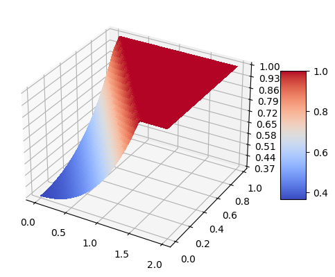

## Physics Informed Neural Network (PINN): A toy example
A repository of simple implementation of PINN.

Paper: [Physics Informed Deep Learning (Part I): Data-driven Solutions of Nonlinear Partial Differential Equations](https://arxiv.org/abs/1711.10561)

